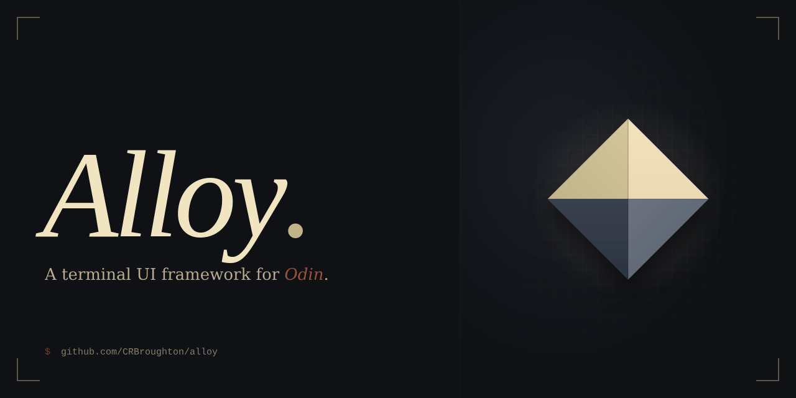

A TUI framework for Odin;

- **alloy** - full-screen TUI apps using the Elm Architecture (init / update / view)
- **forge** - inline CLI wizards; step-by-step prompts that stay in the terminal scroll history

> **Early development** alloy and forge are in rapid, early development. APIs will change, features are incomplete, and there are known rough edges. Not recommended for production use yet.

---

## alloy

Inspired by Bubble Tea. Full-screen, alternate-screen buffer, event loop driven.

### Install

Copy `src/alloy/` and `src/alloy-components/` into your project's `vendor/` folder:

```sh
cp -r src/alloy/ your-project/vendor/alloy/
cp -r src/alloy-components/ your-project/vendor/alloy-components/
```

Then import:

```odin
import alloy "vendor/alloy"
```

### Quick start

```odin
package main

import "core:fmt"
import alloy "vendor/alloy"

Model :: struct { count: int }

my_init :: proc() -> (^Model, alloy.Cmd) {
    return new(Model), nil
}

my_update :: proc(m: ^Model, msg: alloy.Msg) -> (^Model, alloy.Cmd) {
    if km, ok := msg.(alloy.KeyMsg); ok {
        if km.key == .CtrlC do return m, alloy.quit
        if km.key == .Rune && km.rune == '+' do m.count += 1
    }
    return m, nil
}

my_view :: proc(m: ^Model) -> string {
    return fmt.tprintf("Count: %d  (+ to increment, Ctrl+C to quit)\r\n", m.count)
}

main :: proc() {
    alloy.run(&alloy.Program(Model){
        init = my_init,
        update = my_update,
        view = my_view,
    })
}
```

### Components

- **TextInput**: single-line text field with cursor, placeholder, and focus state
- **Select**: keyboard-navigable option list; returns `SelectDoneMsg` on confirm
- **Spinner**: animated indicator driven by a self-scheduling `SleepCmd` timer
- **Confirm**: yes/no prompt with configurable default; returns `ConfirmMsg` on answer
- **MultiSelect**: checkbox list; Space to toggle, Enter to confirm; returns `MultiSelectDoneMsg`
- **Box**: bordered container with title and four border styles (Rounded, Single, Double, Heavy)
- **Grid**: column-based layout with `fr` and `Fixed` track types and configurable gap

### Timer-based commands

Use `sleep` to schedule any delayed message, not just spinners:

```odin
import "core:time"

// Deliver a custom message after 2 seconds:
return m, alloy.sleep(2 * time.Second, MyTimeoutMsg{})
```

`sleep` accepts any value that satisfies the `Msg` union; define your own message types in your app.

---

## forge

Inspired by Clack. Inline wizard prompts; no alternate screen. Each completed step stays visible in the terminal.

<video src="demos/forge-multi-select.webm" autoplay loop muted playsinline></video>                                               

### Install

Copy `src/forge/` and `src/alloy-components/` into your project's `vendor/` folder:

```sh
cp -r src/forge/ your-project/vendor/forge/
cp -r src/alloy-components/ your-project/vendor/alloy-components/
```

Then import:

```odin
import forge "vendor/forge"
```

### Quick start

Chain prompts sequentially; check `.status` after each step to handle cancellation:

```odin
package main

import "core:fmt"
import forge "vendor/forge"

main :: proc() {
    name := forge.run_text_prompt("Project name?", "my-app")
    if name.status == .Cancelled do return

    framework := forge.run_select_prompt("Framework?", []forge.SelectOption{
        {label = "React",  value = "react"},
        {label = "Vue",    value = "vue"},
        {label = "Svelte", value = "svelte"},
    })
    if framework.status == .Cancelled do return

    install := forge.run_confirm_prompt("Install dependencies?")
    if install.status == .Cancelled do return

    forge.wizard_end()

    fmt.printf("Creating %s with %s...\n", name.value, framework.value)
}
```

### Prompts

- **run_text_prompt**: single-line text input with optional placeholder; supports `mask = true` for passwords
- **run_select_prompt**: arrow-key navigable option list; returns the selected value
- **run_confirm_prompt**: Yes/No toggle with Left/Right arrows and `y`/`n` shortcuts
- **run_multi_select_prompt**: checkbox list; Space to toggle, Enter to confirm; supports `default` and `description` per option

Each prompt returns a `StepResult`:

```odin
StepResult :: struct {
    value:  string,    // display string (single value, or comma-joined for multi-select)
    values: []string,  // selected values (multi-select only; caller owns — call delete())
    status: StepStatus, // .Done, .Cancelled, .Error
}
```

### Multi-select options

`MultiSelectOption` extends `SelectOption` with per-option defaults and descriptions:

```odin
extras := forge.run_multi_select_prompt("Extras?", []forge.MultiSelectOption{
    {label = "ESLint",   value = "eslint",   description = "Fast linting",    default = true},
    {label = "Prettier", value = "prettier", description = "Code formatter"},
    {label = "Husky",    value = "husky",    description = "Git hooks"},
})
if extras.status == .Cancelled do return
defer delete(extras.values)

for v in extras.values {
    fmt.printf("  installing %s\n", v)
}
```

### Task runner

Run sequential tasks with a live spinner after your prompts:

```odin
SetupCtx :: struct { name: string }
ctx := SetupCtx{name = name.value}

result := forge.run_task_step(
    label         = "Setting up project",
    ctx           = &ctx,
    stop_on_error = true,
    tasks         = []forge.Task(SetupCtx){
        {
            label = "Create directory",
            run   = proc(c: ^SetupCtx) -> bool {
                return os.make_directory(c.name) == nil
            },
        },
        {
            label = "Init git repository",
            run   = proc(c: ^SetupCtx) -> bool {
                res := forge.exec({"git", "init", c.name})
                return res.exit_code == 0
            },
        },
    },
)
if result.status == .Error do return

forge.wizard_end()
```

---

## Running tests

```sh
just test
```
